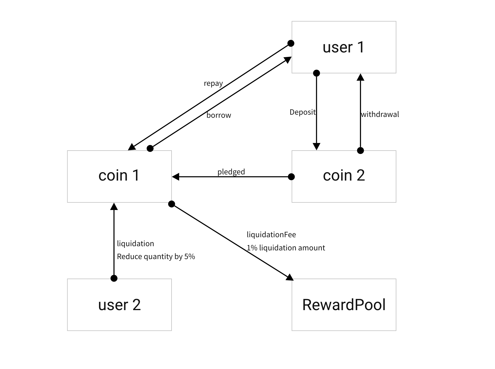

# wkswap-protocol

### Function diagram

### Liquidation process
1. The liquidator pays the token lent by the user
2. Reduce users' borrowings and pledges
3. 1% of the liquidation amount is transferred to the reward pool 
4. 99% of the liquidated pledged tokens shall be transferred to the liquidator